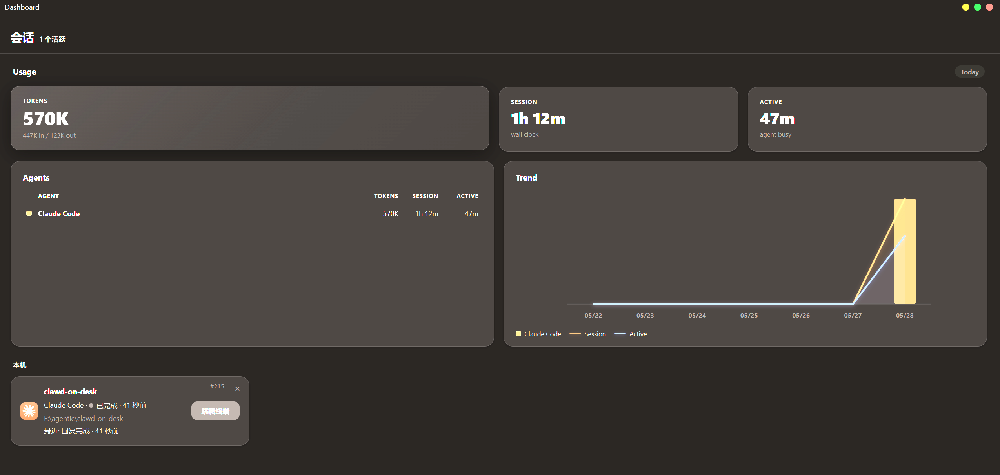
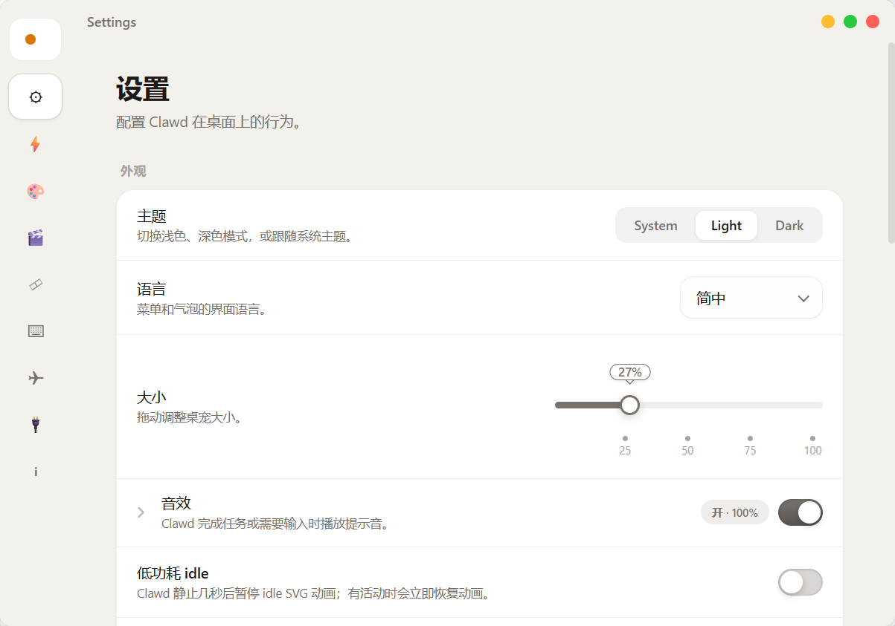
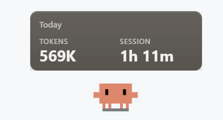

<p align="center">
  
</p>
<h1 align="center">Petlaude</h1>
<p align="center">
  <a href="README.zh-CN.md">简体中文</a>
  ·
  <a href="README.zh-TW.md">繁體中文</a>
  ·
  <a href="README.ko-KR.md">한국어</a>
  ·
  <a href="README.ja-JP.md">日本語</a>
</p>
<p align="center">
  <sub>An enhanced fork of <a href="https://github.com/rullerzhou-afk/clawd-on-desk">Clawd on Desk</a> — refined UI, theme support, usage analytics, and subscription value tracking.</sub>
</p>
<p align="center">
  
  
  
</p>

> A desktop pet that reacts to your AI coding agent in real time. Start a long task, walk away, come back when the pet tells you it's done.

---

## ✨ What's New in Petlaude

### 💎 Subscription Value Dashboard

Stop thinking of your AI subscription as a spending limit — it's a multiplier. The redesigned quota cards show you the **API-equivalent value** you've consumed this month, not how much "budget" you have left.

- **Large headline** shows real API-equivalent cost (cache discounts applied)
- **Breakeven bar** turns blue → green once your usage value exceeds your plan price
- **`×N` multiplier badge** appears when you've exceeded the plan price — you're in profit territory
- **"Saved $X"** label celebrates the surplus above what you paid; **"$X to break even"** shows progress before that
- Works for any agent with a configured plan price (Claude Pro, GPT Plus, Gemini Advanced, etc.)

The insight: Claude Pro costs $20/mo but unlocks API-equivalent value that can reach $200+ with heavy Opus usage. The dashboard celebrates that, rather than flagging it as "over budget."

### 📊 Interactive Chart Tooltips

Hover over any point on the analytics charts to inspect exact values:

- **Vertical crosshair** snaps to the nearest data point
- **Floating tooltip** shows date, session count, token breakdown, and estimated cost
- Works on the cost trend line and usage bar chart

### 〰️ Smooth Analytics Curves

Cost and usage trend lines now use **monotone cubic Hermite spline** interpolation — curves that are smooth without overshooting or inverting. The shape faithfully reflects your actual data.

### 🔢 Accurate Token Accounting

Token counts are large by design — but the costs are not. The analytics engine:

- **Deduplicates** API calls that fire both `PreToolUse` and `PostToolUse` hook events
- **Discounts cache reads** at the correct per-model rate (typically ~10× cheaper than fresh input)
- Shows **API-equivalent cost**, not an inflated naive sum that counts all tokens equally

Example: 11M tokens/day sounds alarming. If 94% are prompt-cache reads, the real API-equivalent cost is ~$12, not $173.

### 📋 Subscription Plan Manager

Set your monthly plan price per agent in Settings → Agents. The dashboard then tracks your breakeven progress and multiplier automatically. The OK button now reliably saves changes.

---

### 🔔 Task Complete Bubble

When your AI agent finishes a task, a notification bubble pops up with a **"Go to"** button that focuses the agent's terminal window — no more hunting for the right tab. Works with Claude Code, Codex, Gemini, Copilot, and every supported agent. Smart dedup and cooldown prevent spam during rapid session restarts.

### 🖱️ Pet Double-Click Action

Configure what happens when you double-click the desktop pet — launch Codex, Claude, your editor, or any executable. Choose between Terminal mode (for CLI agents) and Direct mode (for GUI apps), with an optional default workspace folder.

### 📂 File Drag-and-Drop

Drag files and folders onto the pet! A directional catch animation plays as you hover, then a smart bubble offers context-aware actions: focus the matching agent session, open the dashboard, launch your configured pet click action, or copy paths to the clipboard.

### 🪟 Borderless Mac-style Windows

Dashboard and Settings windows have been redesigned with a modern borderless look — rounded corners, smooth title bars, and content that blends naturally into the window frame. Traffic-light window controls (close / minimize / maximize) replace clunky native title bars.

<p align="center">
  
  <br><sub>Dashboard — session list with usage analytics and subscription value cards</sub>
</p>

<p align="center">
  
  <br><sub>Settings — borderless window with theme switcher</sub>
</p>

### 🎨 Light / Dark / System Theme

A new appearance mode lets you switch between light, dark, and system-following themes independently from your OS settings. Card backgrounds, text, and borders adapt seamlessly.

### 📈 Vibe Coding Analytics

Track your AI coding sessions with time, token, and cost statistics directly in the dashboard:

- **Usage bar chart** — daily agent usage broken down by agent (Claude Code, Codex, Gemini, Copilot, etc.)
- **Cost trend line** — smooth monotone cubic interpolation overlaying session cost trends
- **Interactive tooltips** — hover any chart point for exact date, tokens, and cost
- **Dual-axis labels** — token counts on the left, time duration on the right
- **Usage hover** — hover over the desktop pet for a quick popup with today's agent breakdown

<p align="center">
  
  <br><sub>Usage hover — today's agent time at a glance</sub>
</p>

Sessions and costs are persisted in a local JSONL ledger, so your stats survive restarts.

### 🔥 Usage Heatmap

A **GitHub-style contribution heatmap** (53 weeks × 7 days) visualizes your coding activity over the past year. Hover any cell to see the day's token count, models used, and provider breakdown. Tracks active day rate, current streak, and peak day.

### 💰 Usage Cost Tracking

Every tracked session includes **cost estimates** powered by a multi-tier model pricing engine. The resolver matches model names against curated overrides, a LiteLLM pricing snapshot (~2,000+ models), and fuzzy fallback rules — covering mainstream providers (Claude, GPT, Gemini) plus niche agents. Token usage is priced per million tokens (input, output, cache read, cache write, reasoning).

### 🤖 Automatic Model Detection

Model names are **resolved from agent transcript files** when the hook payload doesn't include them directly. Results are cached per session to avoid repeated file I/O.

### 📊 Enhanced Dashboard — Period Tabs & Provider Overview

The usage dashboard features **period selectors** (Today / 7 days / 30 days / Total) with:

- **Provider overview** — colored bar chart and cards showing token share, cost, and top models per AI provider
- **Stats panel** — 7-day and 30-day rolling totals, average active day metrics, conversation counts, and top model highlight
- **Cost column** — every agent row shows estimated USD cost alongside token counts
- **Token type breakdown** — inline display: `input / cache / output / reasoning / unknown`

### 🖥️ Windows Terminal Focus Reliability

The focus system has been hardened for Windows Terminal with a multi-layered fallback strategy: MainWindowHandle fast path → process ancestor chain walk → any WindowsTerminal process → AppActivate last resort.

### 🏷️ Permission Bubble Agent Labels

Permission bubbles now show the agent's display name, making it clear which agent is asking for access — especially useful when running multiple agents simultaneously.

### 🔌 Codex Hook Shim

Codex hook registration generates a **shim script** that spawns the real hook as a child process. If the hook script is missing or crashes, the shim fails open rather than blocking the agent.

### 🌐 Expanded Agent Compatibility

All agent hooks recognize **40+ token field name variants** across camelCase, snake_case, and vendor-specific formats — covering edge cases from Copilot's `tokensIn`/`tokensOut` to Gemini's `promptTokenCount`/`candidatesTokenCount`.

---

## 🐾 Pet Features

The desktop pet reacts to what your AI coding agent is doing in real time:

- **12 animated states** — idle, thinking, typing, building, subagent groove, multi-subagent juggling, error, happy, notification, sweeping, carrying, sleeping
- **Eye tracking** — the pet follows your cursor in idle state
- **Sleep sequence** — yawns, dozes, collapses after 60s of inactivity
- **Drag anywhere** — grab the pet from any state and move it around
- **Mini mode** — drag to screen edge to auto-hide; peek on hover
- **Click reactions** — double-click to poke, 4 clicks to flail
- **Three built-in themes** — Clawd (pixel crab), Calico (calico cat), Cloudling

### Multi-Agent Support

Works with **Claude Code**, **Codex CLI**, **Copilot CLI**, **Gemini CLI**, **Antigravity CLI**, **Cursor Agent**, **CodeBuddy**, **Kiro CLI**, **Kimi Code CLI**, **Qwen Code**, **opencode**, **Pi**, **OpenClaw**, and **Hermes Agent**. Run multiple agents simultaneously — the pet tracks each session independently.

### Permission Bubbles

When an agent requests tool permissions, the pet pops a floating bubble card so you can Allow / Deny without switching to the terminal. Supports global hotkeys (`Ctrl+Shift+Y` to Allow, `Ctrl+Shift+N` to Deny).

### Session Dashboard & HUD

Right-click → Open Dashboard to inspect live sessions, event history, usage analytics, and jump to a terminal. A compact HUD near the pet keeps current sessions visible at a glance.

### System

- **Click-through** — transparent areas pass clicks to windows below
- **Position memory** — remembers where you left it across restarts
- **Do Not Disturb** — right-click to suppress all notifications
- **System tray** — resize, DND, language switch, auto-start, check for updates
- **i18n** — English, Simplified Chinese, Traditional Chinese, Korean, Japanese

---

## 🚀 Quick Start

Download the latest installer from **[Releases](https://github.com/zuoqiumama/Petlaude/releases)**.

Or run from source:

```bash
git clone https://github.com/zuoqiumama/Petlaude.git
cd Petlaude
npm install
npm start
```

Agent hooks are auto-registered on first launch. For detailed setup per agent, see the original [setup guide](docs/guides/setup-guide.md).

---

## 👥 Credits

**Petlaude** is maintained by **[@zuoqiumama](https://github.com/zuoqiumama)**, with UI redesign, theme system enhancements, usage analytics, and subscription value tracking.

Built on top of **[Clawd on Desk](https://github.com/rullerzhou-afk/clawd-on-desk)** by 鹿鹿 ([@rullerzhou-afk](https://github.com/rullerzhou-afk)) and [50+ contributors](https://github.com/rullerzhou-afk/clawd-on-desk#contributors). Thank you to everyone who built and improved the original project.

## 📄 License

Source code is licensed under [AGPL-3.0](LICENSE). Artwork and theme assets are NOT covered by AGPL-3.0 — all rights reserved by their respective copyright holders.

- Clawd character is the property of [Anthropic](https://www.anthropic.com). Unofficial fan project.
- Calico & Cloudling artwork by 鹿鹿 ([@rullerzhou-afk](https://github.com/rullerzhou-afk)). All rights reserved.
